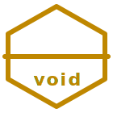

<p align="center">
  
</p>

<h1 align="center">⬡ void</h1>

<p align="center"><strong>Void</strong> — grid-first terminal · Ghostty hard fork · N×M tiling as a core surface · <strong>beta: grid mode only</strong></p>

<p align="center">
  <a href="LICENSE"></a>
  <a href="https://github.com/ghostty-org/ghostty"></a>
  
  
  
  <a href="https://github.com/dancinlab/void/tree/void/main"></a>
</p>

<p align="center">grid-mode · tiling-surface · terminal · pty · tool-call-stream · perf-first · zig · swift · gtk · metal · opengl</p>

---

Void is a hard fork of [Ghostty](https://github.com/ghostty-org/ghostty) where an N×M pane grid is a first-class rendering surface — not a window-manager bolt-on, not a tmux-style multiplexer process. When cell count `N` changes the layout auto-rebalances (`cols = ⌈√N⌉, rows = ⌈N/cols⌉, cols ≥ rows`), each cell carries its own cwd/env, and input can broadcast to all cells. It inherits Ghostty's engine (SIMD parser, Metal/OpenGL, per-terminal threads) unchanged. Zig shared core, native Swift on macOS, GTK on Linux.

> **Beta status — grid mode is the only implemented direction.** Two further directions are *planned, not yet built*: a structured agent I/O channel alongside PTY (roadmap P3) and a per-PR perf budget vs the Ghostty baseline (roadmap P4). They are described below as roadmap, not as shipped features.

> [!NOTE]
> Part of the dancinlab n = 6 family — hexagonal icon, sibling to [NEXUS](https://github.com/dancinlab/nexus), [Anima](https://github.com/dancinlab/anima), [N6](https://github.com/dancinlab/canon), and [HEXA-LANG](https://github.com/dancinlab/hexa-lang). Void is a UX divergence from Ghostty, not a drop-in replacement; upstream syncs are selective cherry-picks only and full Ghostty history/credit is preserved.

## At a glance

```
   spawn a pane with cmd+ctrl+1..9 — the grid auto-rebalances

   N = 2          N = 4               N = 6                  N = 9
   ┌────┬────┐    ┌────┬────┐         ┌───┬───┬───┐          ┌───┬───┬───┐
   │ 1  │ 2  │    │ 1  │ 2  │         │ 1 │ 2 │ 3 │          │ 1 │ 2 │ 3 │
   │~/p │~/w │    ├────┼────┤         ├───┼───┼───┤          ├───┼───┼───┤
   └────┴────┘    │ 3  │ 4  │         │ 4 │ 5 │ 6 │          │ 4 │ 5 │ 6 │
                  │~/l │~/r │         │~/r│~/s│~/t│          ├───┼───┼───┤
   2 × 1          └────┴────┘         └───┴───┴───┘          │ 7 │ 8 │ 9 │
                  2 × 2               3 × 2                  └───┴───┴───┘
                                                             3 × 3

   cols = ⌈√N⌉   rows = ⌈N/cols⌉   cols ≥ rows   ·   per-cell cwd   ·   no manual resize handles   ·   no tmux
```

```sh
void                   # launch terminal
cmd+g                  # toggle grid mode <-> tab mode
cmd+ctrl+1..9          # spawn a tab in grid slot 1..9 (auto-rebalances)
cmd+ctrl+shift+1..9    # cycle tabs within a grid slot
cmd+ctrl+0             # broadcast input to all cells
```

## Why void

Three things upstream Ghostty treats as explicit non-goals — Void forks to take exactly these bets.

### 1. Grid mode — a first-class tiling surface

```
   cells = N                              on add / remove the whole grid
   ──────────────────────────────         re-balances to equal splits:
   N = 2  →  2 × 1                        cols = ⌈√N⌉
   N = 4  →  2 × 2                        rows = ⌈N/cols⌉
   N = 6  →  3 × 2                        cols ≥ rows (wider before taller)
   N = 9  →  3 × 3                        (no manual resize handles)
```

The N×M grid is a new renderer path, not a patch on the single-surface renderer and not a multiplexer process. Per-cell cwd / env, shared input routing, broadcast. No tmux, no prefix key, no config DSL to learn. This is the headline — the other two directions sit on top of it.

### 2. Ghostty hard fork — performance inherited, not rebuilt

Void did not rebuild a terminal. It hard-forks a fast one and changes three things. The SIMD parser, Metal (macOS) / OpenGL (Linux) renderers, and per-terminal render/read/write threads come straight from Ghostty. 4698 files were renamed Ghostty → Void at commit `964c9e32e`; upstream history and contributor credit are preserved (cherry-pick only, no clean merges).

### 3. AI-native I/O and a perf budget (roadmap — not yet implemented)

```
   shell process     ┌──── PTY ────────▶  traditional byte stream
        │            │
        ▼            ├──── AGENT ──────▶  structured tool-call events
   libvoid layer ────┤                    token stream w/ boundaries
        ▲            └──── META ───────▶  cwd, exit-code, span marks
        │
   agent process      (no wrapper process required)
```

**Neither of these is built yet — the beta is grid-only.** The plan: a structured agent channel **alongside** PTY (tool-call events and token-stream boundaries as a data model, not heuristic-parsed from stdout) — roadmap P3, deliberately not the headline since Void is grid-first, not an "AI overlay" terminal. And a perf budget where every PR reports a delta against the Ghostty baseline with a **≥ 2 % regression blocking merge** — roadmap P4, the harness is not wired yet. Both are described here as intent, not as shipped behaviour.

## Highlights

| | |
|---|---|
| ▦ | **Grid mode** *(implemented)* — N×M pane grid as a core surface, auto-layout (`cols = ⌈√N⌉, rows = ⌈N/cols⌉`), per-cell cwd, broadcast |
| ⬡ | **Ghostty-grade performance** *(inherited)* — SIMD parser, per-terminal render/read/write threads, Metal on macOS, OpenGL on Linux |
| ◈ | **Native UI** *(inherited)* — SwiftUI on macOS (AppIntents, Shortcuts), GTK on Linux (systemd, cgroup isolation) |
| ⚡ | **Perf budget** *(roadmap P4 — not built)* — plan: every PR reports Δ against the Ghostty baseline; ≥ 2 % regression blocks merge |
| ◆ | **AI-native I/O** *(roadmap P3 — not built)* — plan: agent protocol alongside PTY; structured tool-call / token-stream channels, no wrapper |
| ↻ | **Session restore** *(implemented)* — per-pane mmap'd ring of raw PTY bytes; auto-replay on void/macOS crash restores scrollback + colors + cursor (no upstream Ghostty equivalent) |
| ⬢ | **dancinlab branding** — hexagonal icon, n = 6 family (NEXUS · Anima · N6 · HEXA · Void) |

## Architecture

```
       ┌──────────────────────────────────────────┐
       │            macOS App (Swift)             │
       │    SwiftUI · AppIntents · CoreText       │
       │        Metal renderer · native menu      │
       └──────────────┬───────────────────────────┘
                      │
       ┌──────────────▼───────────────────────────┐
       │          libvoid (Zig) — core            │
       │   parser · terminal state · renderer     │
       │   grid engine   (agent I/O: roadmap)     │
       └──────────────┬───────────────────────────┘
                      │
       ┌──────────────▼───────────────────────────┐
       │            Linux App (GTK)               │
       │      systemd · OpenGL · FreeType         │
       └──────────────────────────────────────────┘
```

Zig-based shared core with platform-native shells. Core is C-ABI-compatible so it can be embedded in third-party projects (Ghostty's `libghostty` pattern — renamed to `libvoid` in this fork).

## Install

```sh
# 1. Install hexa-lang (gives you `hexa` + `hx` package manager)
curl -fsSL https://raw.githubusercontent.com/dancinlab/hexa-lang/main/install.sh | bash

# 2. Install void
hx install void
```

Or build from source — see [HACKING.md](HACKING.md). Default branch on the fork is `void/main`, not `main`.

## Run

```sh
void                   # launch terminal
void +show-config      # print active config
void +list-keybinds    # list keybindings
void +crash-report     # list crash reports
```

## Keybindings (default)

| Keys | Action |
|------|--------|
| `cmd+g` | toggle **grid mode ↔ tab mode** |
| `cmd+ctrl+1..9` | spawn new tab in grid slot **1..9** (stacks — repeated presses add tabs to the same slot) |
| `cmd+ctrl+shift+1..9` | cycle tabs within grid slot |
| `cmd+ctrl+0` | **broadcast** input to all cells |
| `cmd+opt+return` | find next (relocated from `cmd+g`) |
| `cmd+shift+opt+return` | find previous (relocated from `cmd+shift+g`) |
| `cmd+t` / `cmd+n` | new tab / new window |
| `cmd+d` / `cmd+shift+d` | split pane right / down |
| `cmd+,` | open settings |

All keys are rebindable via config — nothing is hardcoded.

## Fork status

| | |
|---|---|
| **Upstream** | [`ghostty-org/ghostty`](https://github.com/ghostty-org/ghostty) — cherry-picks only, no merges |
| **Fork date** | 2026-04-21 (from upstream commit `c3c8572f7`) |
| **Default branch** | `void/main` |
| **L3 rename** | complete — 4698 files renamed Ghostty → Void at commit `964c9e32e` |
| **CI** | `.github/workflows/build-fork.yml` on GitHub-hosted `macos-15` runners (ad-hoc codesign) |
| **Icon** | hexagonal, dancinlab n = 6 family |

See [VOID_FORK.md](VOID_FORK.md) for the full fork rationale, non-goals, and upstream policy.

## Roadmap

Checkpoints (done):

|  #  | Milestone                                  | Date       |
| :-: | ------------------------------------------ | :--------: |
| C0  | project-init — hexa scaffold               | 2026-04-21 |
| C1  | fork-base — Ghostty → Void rebrand         | 2026-04-21 |

Phases:

|  #  | Phase                                                               |  ETA       | Status |
| :-: | ------------------------------------------------------------------- | :--------: | :----: |
| P1  | **Grid mode + new-tab keybinding** — auto-grid, slot-spawn, mode toggle | 2026-05-18 |   ✅   |
| P2  | Stack analysis — map void renderer/apprt/terminal/font internals    | 2026-05-05 |   ⬜   |
| P3  | AI-native I/O protocol — structured agent channel alongside PTY     | —          |   ⬜   |
| P4  | Perf baseline — capture benches, set void regression budgets        | —          |   ⬜   |
| P5  | Diverge / upstream strategy — decide what feeds back vs stays void  | —          |   ⬜   |

P1 (grid mode) is complete: surface rendering, N×M auto-layout (`cols = ⌈√N⌉`), `cmd+ctrl+1..9` slot-spawn, broadcast, and per-cell cwd all landed. P4 (perf baseline) is next — capturing the Ghostty-baseline benches before further divergence accumulates.

## Non-goals

- **Not a drop-in Ghostty replacement** — Void will diverge in UX.
- **Not a shell** — Void drives shells, it does not replace them.
- **Not an "AI terminal"** — grid mode is the headline and the only thing built; agent I/O is an unimplemented roadmap direction, never an overlay.

## Crash reports

Void inherits Ghostty's crash reporter. Reports are saved to `$XDG_STATE_HOME/void/crash` (default `~/.local/state/void/crash`) and are **not** sent off your machine. Use `void +crash-report` to list. Reports use the [Sentry envelope format](https://develop.sentry.dev/sdk/envelopes/) with extension `.voidcrash`.

> [!WARNING]
> Crash reports contain full stack memory per thread at the time of the crash and can include sensitive data.

## Session restore — survive abnormal termination

When void or macOS dies abnormally, void re-opens with the previous **terminal contents** (scrollback, colors, cursor) restored — not just the window layout. The mechanism is fork-only (no upstream Ghostty equivalent); see [`docs/design/sighup-resistant-session.md`](docs/design/sighup-resistant-session.md) for the full design.

### Two failure modes, one experience

| Scenario | Event | What survives |
|---|---|---|
| **A**: void only dies | segfault, OOM, jetsam `SIGKILL` | grid + per-pane terminal content |
| **B**: macOS dies | kernel panic, hard shutdown, power loss | same (bounded ≤ 1s loss) |

### How it works

```
       ┌──────────────────────────────────────────┐
       │  macOS NSWindowRestoration (existing)    │  ← grid topology + per-surface UUID
       │  TerminalRestorable.swift                │    survive force-quit / crash
       └──────────────┬───────────────────────────┘
                      │  uuid round-trips via Codable
       ┌──────────────▼───────────────────────────┐
       │  PersistRing (mmap, 4 MB / pane)         │  ← raw PTY byte stream → disk
       │  ~/.void/sessions/by-uuid/<uuid>.ring    │    memcpy + msync(MS_ASYNC) every 1s
       └──────────────┬───────────────────────────┘
                      │  on relaunch
       ┌──────────────▼───────────────────────────┐
       │  Termio.init replay → processOutput      │  ← bytes (ANSI + colors + cursor)
       │  BEFORE io read thread starts            │    fed back through SIMD parser
       └──────────────────────────────────────────┘
```

- **Write side** — `Termio.processOutput` appends every PTY byte to an mmap'd ring (`memcpy`, ~0µs, lock-free per pane). `msync(MS_ASYNC)` fires every 1s → kernel page cache + dirty-page flush bound Scenario B loss to ≤ 1 second. Scenario A loses nothing because mmap `MAP_SHARED` page cache survives process death.
- **Read side** — at surface init, if a ring exists at the UUID-keyed path, `PersistRing.replay()` extracts up to 4 MB of most-recent bytes, and `Termio.processOutputLocked` feeds them through the parser **before** the io read thread spawns. The new shell still starts fresh underneath; the visual scrollback is reconstructed via ANSI replay.

### Enable

```ini
# void config
window-save-state    = always     # macOS NSWindowRestoration (already documented)
persist-bytes-mmap   = true       # opt-in: enable per-pane ring buffer
```

### What's restored / what isn't

| ✅ Restored | ❌ Not restored |
|---|---|
| scrollback text | running processes (PTY child is fresh) |
| colors + text attributes (via ANSI escapes in byte stream) | live cursor position from a long-running TUI |
| grid topology + per-pane cwd (via existing `TerminalRestorable`) | environment variables that diverged at runtime |
| focused pane, tab color, title overrides | sub-process state (vim buffers, REPL history, etc.) |

Apple Terminal.app's "Tab Contents v2" mechanism is plain-text-only (no colors); void's ring is raw bytes including ANSI sequences, so attributes round-trip.

### Manual recovery

If auto-replay doesn't trigger (e.g. UUID lost, ring schema changed), the byte stream is still on disk:

```sh
tool/void-session-replay.sh --list           # enumerate ring files
tool/void-session-replay.sh --latest         # dump most recent ring to stdout
tool/void-session-replay.sh --all            # dump every ring
tool/void-session-replay.sh <path-to-ring>   # dump a specific ring
```

Pipe to `less -R`, `cat`, or save to a file.

### Storage layout

```
~/.void/sessions/by-uuid/
    <uuid>.ring   # 4 MB mmap'd ring buffer per pane
    ...
```

Ring files are not garbage-collected automatically — `rm -rf ~/.void/sessions/by-uuid` is safe between sessions when you want to start fresh.

## Status

- **Beta — grid mode is the only implemented direction.** P1 (grid mode + new-tab keybinding) **complete** (2026-05-18): surface rendering, N×M auto-layout, slot-spawn, broadcast, per-cell cwd
- Inherited from Ghostty (not Void-built): SIMD parser, Metal/OpenGL renderers, per-terminal threads, native Swift/GTK shells, crash reporter
- Void-only support infra (shipped, not a "direction"): session-restore via per-pane mmap byte ring — see [Session restore](#session-restore--survive-abnormal-termination)
- **Not yet implemented:** AI-native I/O (roadmap P3) · perf-budget harness (roadmap P4) — described in this README as intent, not shipped behaviour
- Fork date: 2026-04-21 (from upstream commit `c3c8572f7`); default branch `void/main` (not `main`)
- L3 rename complete — 4698 files renamed Ghostty → Void at commit `964c9e32e`
- Next: P4 perf baseline (capture Ghostty-baseline benches), then Show HN / r/commandline launch
- CI: `.github/workflows/build-fork.yml` on GitHub-hosted `macos-15` runners (ad-hoc codesign)

## Repo layout

```
void/
├── README.md
├── AGENTS.md / AGENTS.tape         project ops manual + machine-readable companion
├── VOID_FORK.md                    fork rationale + non-goals + upstream policy
├── HACKING.md / CONTRIBUTING.md    dev + contribution guides
├── LICENSE                         MIT
├── build.zig / build.zig.zon       Zig build entry + manifest
├── src/                            libvoid (Zig core) — parser · terminal state · renderer · grid  (agent I/O: roadmap)
├── macos/                          Swift app (SwiftUI · AppIntents · Metal · CoreText)
├── linux/ + gtk/                   GTK app (systemd · OpenGL · FreeType)
├── pkg/                            vendored package wrappers
├── include/                        C-ABI headers for libvoid embedders
├── images/                         icon + brand assets (hexagon n=6 family)
├── docs/                           reference docs + logo.svg
├── conformance/                    terminal protocol conformance tests
├── bench/                          perf budget harness — roadmap P4 (Δ vs Ghostty baseline)
├── nix/ + flake.nix                Nix build entry
└── .github/workflows/              CI (build-fork.yml on macos-15 runners)
```

## Contributing

- **Contributing to Void** — [CONTRIBUTING.md](CONTRIBUTING.md)
- **Developing Void** — [HACKING.md](HACKING.md)
- **Fork rationale & upstream policy** — [VOID_FORK.md](VOID_FORK.md)

## Credits

Void is a hard fork of **[Ghostty](https://github.com/ghostty-org/ghostty)** by [Mitchell Hashimoto](https://mitchellh.com) and the Ghostty team. All Ghostty contributors are credited in upstream history, which is preserved in this repo. Divergent work — grid mode (implemented), plus the planned AI-native I/O and perf-harness directions — is Void-only.

## License

[MIT](LICENSE) — same license as upstream Ghostty. All Ghostty contributors are credited in upstream history (preserved in this repo); divergent work (grid mode implemented; AI-native I/O and perf-harness planned) is Void-only.

---

<sub>⬡ Terminal as substrate. Grid as primitive. · Based on [Ghostty](https://github.com/ghostty-org/ghostty) · [dancinlab](https://github.com/dancinlab)</sub>
